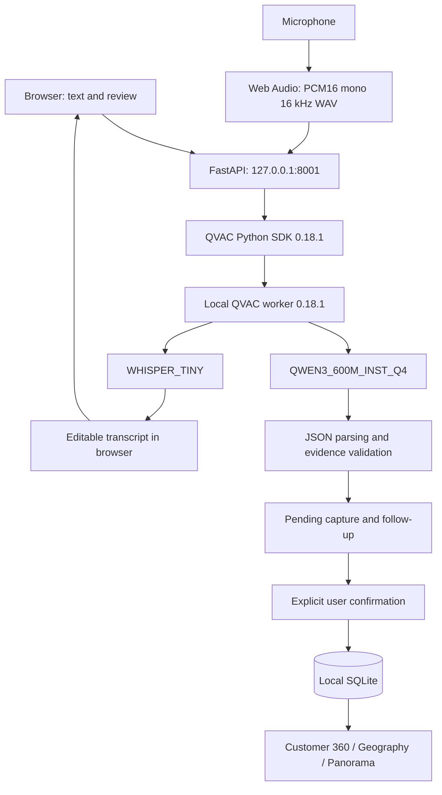

# FieldScope

**Customer Installed Base Intelligence**

Turning field observations into a living, trusted and actionable view of customer technology environments.

## Overview

FieldScope turns a field visit into a structured, reviewable record of a customer's installed medical equipment. A field employee types or dictates an observation, reviews the local extraction, answers a small number of missing-field questions, and confirms the record. Customer 360, geographic navigation and Panorama then read the same local SQLite database.

This is a locally tested hackathon prototype. The existing FastAPI, SQLAlchemy, SQLite and vanilla HTML/CSS/JavaScript architecture is retained. Text extraction uses **QVAC 0.18.1 with QWEN3_600M_INST_Q4**; dictation uses **QVAC WHISPER_TINY**. There is no cloud inference route.

## Hackathon Challenge

The supplied **Customer Installed Base Intelligence** challenge asks teams to turn unstructured customer observations into a useful installed-base view. FieldScope covers capture, extraction, validation, persistence, customer context and aggregation. It also implements bounded follow-up, local voice capture and explainable quality indicators. The seed uses fictional facilities, cities, manufacturers and models; countries provide geographic navigation.

## Key Features

**Core MVP**

- Conversational Spanish text capture with local QVAC extraction.
- Review and explicit confirmation before adding records to Installed Base.
- Evidence-based sanitation of quantities, modalities, manufacturers, models, serials, ages and locations. Unknown values remain `null`.
- Customer 360 with equipment and observation history.
- Installed Base filters and region → country → city → customer navigation.
- Panorama with quantities, modalities, age groups, completeness, confidence and freshness.

**Implemented stretch goals**

- Browser microphone → local WAV → QVAC Whisper → editable transcript.
- Conservative duplicate matching and observation-to-equipment provenance.
- Rule-based confidence and freshness indicators.
- One missing-field question at a time, driven by the QVAC extraction. Question selection is deterministic, not a second language model.
- Limited Spanish query grammar over SQLite, including word-number ages. This is deterministic analytics, not general AI reasoning over the dataset.
- Potential renewal signals for equipment reported as at least seven years old, always requiring commercial validation.

Photo-assisted capture and vision are **not implemented**.

## Architecture



Models load once per backend process; Whisper loads lazily on the first dictation. Inference is serialized with a bounded wait. Startup, inference, audio recording and HTTP requests have limits. Shutdown unloads models and closes the worker. Run one backend process, without reload or multiple Uvicorn workers.

## Why QVAC

Customer text and audio are processed on the device. The browser talks to localhost; the backend invokes the local QVAC worker. No cloud AI credential or service is configured. Model and dependency downloads may require Internet before a demonstration.

`QVAC_REQUIRED=true` is the default: unavailable inference returns HTTP 503. Setting both `QVAC_ENABLED=false` and `QVAC_REQUIRED=false` explicitly enables deterministic development tests. Health identifies that mode as `deterministic_dev_fallback`; it must not be presented as QVAC.

If Qwen runs but produces malformed JSON, a local deterministic parser repairs the extraction and the runtime reports `qvac_local_plus_parser_repair`. Valid JSON surrounded by model prose is read structurally. Both paths still pass evidence validation. This small model can omit or misunderstand details; review is part of the workflow.

## Data Model

| Entity | Purpose |
| --- | --- |
| Customer | Name, city, country and creation time; owns equipment and observations. |
| Equipment | A reported equipment group: modality, nullable quantity, manufacturer, model, serial, age, state, confidence and verification dates. A row is not necessarily one physical device. |
| Observation | Raw conversation, reporter label, time, structured snapshot, source and duplicate-update flag. |
| ObservationEquipment | Links one observation to every equipment group it supports. The old `equipment_id` remains for compatibility with the first group. |
| PendingSession | SQLite-backed, unconfirmed conversation and missing-field state. It does not appear in Installed Base until confirmed. |
| CountryRegion | Local custom country mappings; the shared baseline catalog lives in `backend/geography.json`. |

SQLite paths resolve relative to `backend/`, consistently from either working directory. Startup creates missing tables and adds supported legacy columns idempotently. Legacy unknown dates remain unknown; no fresh verification date is invented. Old records are not retroactively re-extracted or attributed to every possible equipment row.

Deleting an observation deletes that history entry and its link rows. It preserves customers, equipment, the current installed-base snapshot and lifetime report counts. It does not roll back previous consolidations.

## Observation States

| UI state | Meaning |
| --- | --- |
| Reportado / Reported | A direct report without independent corroboration. Clicking save alone does not make it confirmed. |
| Estimado / Estimated | The equipment information contains explicit uncertainty or approximation. Repetition does not erase that uncertainty. |
| Confirmado / Confirmed | A compatible, non-estimated equipment report matches a record supported by a different, non-generic reporter label. |
| Desconocido / Unknown | Insufficient evidence; individual unknown fields stay null without changing an otherwise usable report. |

Reporter names are labels, **not authenticated identities**. Confirmed is an application rule, not an external certification.

## Confidence

The score is a completeness/evidence heuristic, not a calibrated probability. Known fields contribute: modality 0.25, manufacturer 0.20, model 0.20, age 0.20 and quantity 0.15. State adjusts this by +0.08 for Confirmado, −0.08 for Estimado or −0.12 for Desconocido. Scores are clamped to 0.05–0.99; missing modality yields zero.

Labels are High ≥ 0.78, Medium ≥ 0.50, Low > 0 and Unknown = 0. The UI displays these labels. Repeating a report with the same reporter does not add a confidence bonus. Confidence and freshness are separate signals.

## Duplicate Detection

Customer matching folds case and accents and requires compatible city/country information. Ambiguous same-name customers produce HTTP 409 so location can distinguish them.

Within a customer and modality, an equipment match requires an exact serial, or matching manufacturer plus matching model or compatible known age. Conflicting manufacturers, models or serials, age differences greater than one year, and conflicting known quantities prevent consolidation. Exactly one compatible candidate is required. Equipment mentioned separately in one capture stays separate.

A match updates known fields, verification dates and `times_reported`; a new observation and provenance links are retained. Modality alone, or modality plus an otherwise unidentified brand, is insufficient. This favors preserving distinct groups over aggressive merging; some duplicates can remain.

## Data Freshness

- Less than 180 days since verification: recent.
- 180–365 days: revalidate soon.
- More than 365 days: stale, requires revalidation.
- No known date: unknown, requires revalidation.

API timestamps include UTC. A matching new observation refreshes the date. Freshness describes the observation's recency, not a guarantee that equipment remains installed.

## Voice Capture

Click the microphone, speak, then click again. Web Audio resamples locally to PCM16 mono 16 kHz WAV. The backend validates the WAV header, channels, rate, sample width, frame length and duration, then passes a temporary file to QVAC Whisper. The temporary WAV is removed after the request, including failures. The transcript returns to the input field for review; it is never automatically saved.

Recording is limited to 60 seconds and uploads to 2 MiB. Very short recordings, unsupported formats and unavailable ASR show errors. Escape, navigation and page exit cancel browser capture and release tracks. Cancelling a submitted request does not guarantee immediate interruption inside the SDK; inference remains bounded on the backend.

Two consecutive browser dictations with a synthetic microphone and real Whisper passed locally. This verifies the capture/encoding/HTTP/ASR/UI path; it does not measure human microphone accuracy, noisy-room performance or every browser. Whisper tiny may misrecognize names and numbers. Correct the transcript before submitting it.

## Requirements

Tested here on Windows x64 with CPython **3.12.14**, Node **24.19.0**, Microsoft Edge, Python SDK **0.18.1** and npm worker **0.18.1**. The application targets Python 3.12; other Python versions and operating systems were not validated in this audit.

QVAC's current [official system requirements](https://docs.qvac.tether.io/system-requirements/) specify Windows 10+ x64 and Vulkan ≥ 1.4, including CPU-only Windows inference. Install appropriate vendor drivers. Use a supported Node LTS release; the version above is the tested version, not a claim about the SDK's minimum. Keep sufficient RAM and disk for the worker and model cache. These selected cached model artifacts were approximately 382 MB (Qwen) and 78 MB (Whisper), excluding runtime overhead.

## Installation — Windows

Use a fresh clone for these installation commands. Do not replace an existing environment or delete an existing database/cache.

```powershell
git clone https://github.com/VITIDEV06/FieldScope.git
cd FieldScope\backend
py -3.12 -m venv venv
.\venv\Scripts\Activate.ps1
python -m pip install --upgrade pip
python -m pip install -r requirements.txt
npm ci
```

Use the Windows `py` launcher to create the environment; a bare `python` can resolve to MSYS. `npm ci` installs the pinned worker locally and FieldScope discovers it, including the hoisted Bare runtime. This is the installation path exercised in this checkout.

A global worker is an alternative, not an additional requirement:

```powershell
npm install -g @qvac/sdk@0.18.1
$env:QVAC_SDK_DIR = "$(npm root -g)\@qvac\sdk"
```

Optional configuration, from `backend/`:

```powershell
if (-not (Test-Path .env)) { Copy-Item .env.example .env }
$env:QVAC_RPC_INIT_TIMEOUT_MS = "120000"
python qvac_warmup.py
python qvac_voice_warmup.py
python run.py
```

The text warmup performs a real extraction and validates its fields. Voice warmup without `--audio` loads the model only; use `python qvac_voice_warmup.py --audio path\to\sample.wav` to test transcription with a PCM16 mono 16 kHz file.

In a second PowerShell terminal, from the repository root:

```powershell
cd frontend
py -3.12 -m http.server 5500 --bind 127.0.0.1
```

Open [FieldScope](http://127.0.0.1:5500), [backend](http://127.0.0.1:8001) or [health](http://127.0.0.1:8001/api/health). Binding to localhost is intentional.

**This audited workstation:** the old `backend/venv` referenced a missing interpreter and `py -3.12` was unavailable. A separate root `.venv` was prepared using the bundled CPython 3.12 runtime; the old environment and data were preserved. To run this checkout now, from the repository root:

```powershell
# Terminal 1: separate, opt-in synthetic demo database
$env:DATABASE_URL = "sqlite:///./data/demo.db"
$env:QVAC_REQUIRED = "true"
$env:QVAC_ENABLED = "true"
.\.venv\Scripts\python.exe -X utf8 backend\seed_demo.py
.\.venv\Scripts\python.exe -X utf8 backend\run.py
```

```powershell
# Terminal 2: same repository root
.\.venv\Scripts\python.exe -m http.server 5500 --bind 127.0.0.1 --directory frontend
```

The seed refuses to populate a database that already has customers. It does not clear or replace records. Without `DATABASE_URL`, the default database is `backend/data/installed_base.db`.

## First Model Download and Offline Verification

Internet can be needed once for npm/Python dependencies and model downloads. Warm both models before the presentation. Do not delete `backend/data/qvac-cache` afterward.

For an offline demonstration on your machine:

1. Run both warmups with Internet available; supply `--audio` for actual transcription.
2. Disconnect Internet using the operating system.
3. Repeat text warmup and voice warmup with a known WAV, then start the app and complete a capture.
4. Check `qvac_ready=true`, `extraction_mode=qvac_on_device`, `last_inference_note=qvac_local` after extraction, and `qvac_asr_ready=true` after dictation.

The implementation is offline-capable after download. Real local model execution was tested with cached models and non-local browser requests blocked. **An operating-system-level network-disconnected test was not performed**. Health's `cloud_inference=false` and `network_required_for_inference=false` describe the configured architecture, not a network packet audit.

## Demo Script

Use the isolated synthetic database above, or begin with an empty database for a minimal narrative.

1. Show Home and the `QVAC local · Listo` status.
2. Enter: `Visité Hospital Demo Aurora en Ciudad Aurora, Brasil. Tienen dos MR LumenWorks de aproximadamente ocho años y un CT NovaMed.`
3. Answer a missing-field question or `No sé`. The application asks at most two optional questions, prioritizing missing manufacturer, age, then model; missing customer/equipment can require clarification up to the six-turn limit.
4. Review MR quantity 2 / age 8 and CT quantity 1 / unknown age and models. Click **Confirmar y guardar**.
5. Show Customer 360 and region → country → city → customer navigation.
6. Show Panorama and the renewal signal; explain that it requires commercial validation.
7. Query `MR en Brasil de más de siete años`.
8. Dictate another fictional visit, review the transcript, then submit it. Delete a history entry to demonstrate that installed equipment is retained.

The requested compatibility fixture, `Hospital DemoCare Pacific en Ciudad de Panamá, Panamá ... dos MR Siemens ... un CT Philips`, is also exercised in QA. These are fictional observations, not claims about real installations.

## Synthetic Data Notice and Privacy

`python backend/seed_demo.py` and `POST /api/seed` create nine fictional customers only on explicit request and only in an empty customer database. They include incomplete fields, unknown quantity, age zero, older equipment and different freshness states across regions. No production customer dataset is shipped.

The app has no cloud inference route or external frontend asset dependency. Local raw conversations, reporter labels, structured data and pending sessions remain in SQLite. Audio is temporary. SQLite and the model cache are not encrypted by the application; local machine access and operating-system protections still matter.

Requests are restricted to local host/origins, SQL uses ORM-bound parameters, displayed user content is escaped, and text/audio/request sizes are bounded. These measures do not constitute authentication or an enterprise security boundary. Do not expose the service to a network or ingest patient data for a hackathon demo.

## Project Structure

```text
backend/
  ai.py                     QVAC lifecycle, text and ASR
  normalization.py          shared vocabulary and evidence validation
  geography.json            region/country catalog and aliases
  main.py                   local API, migrations, capture and analytics
  models.py / schemas.py    persistence and response contracts
  database.py / config.py   local paths and SQLite configuration
  prompts.py                extraction instructions
  seed_demo.py              opt-in synthetic seed
  qvac_warmup.py            real Qwen smoke check
  qvac_verify.py            real Qwen regressions
  qvac_voice_warmup.py       Whisper loading / optional transcription
  mvp_smoke_test.py          deterministic integration smoke
  requirements*.txt         pinned Python dependencies
  package*.json             pinned QVAC worker
  .env.example              non-secret configuration template
frontend/
  index.html / favicon.svg
  css/styles.css
  js/                       capture, voice, customer, geography and analytics
scripts/make_voice_fixture.ps1
tests/                     pytest + real-browser QA (see docs/TESTING.md)
docs/TESTING.md              audit findings, evidence and limitations
```

Environments, node_modules, recordings, databases, backups and model caches are ignored. The root npm package is only the Playwright QA harness; it is not an application backend.

## API Endpoints

| Method | Path | Purpose |
| --- | --- | --- |
| GET | `/api/health`, `/api/capabilities` | Actual runtime readiness and implemented capabilities. |
| POST | `/api/observations/process` | Extract or continue a pending capture. |
| POST | `/api/observations/confirm` | Save the pending capture atomically. |
| DELETE | `/api/observations/pending/{session_id}` | Discard pending capture. |
| GET | `/api/customers`, `/api/customers/{id}` | Customer list and 360 detail. |
| PATCH | `/api/customers/{id}/country` | Assign country using the shared catalog. |
| GET | `/api/equipment`, `/api/observations` | Paginated equipment and history. |
| DELETE | `/api/observations/{id}` | Delete only that observation and its links. |
| GET | `/api/installed-base` | Filters: customer, country, city, modality, manufacturer, min/max age, state. |
| GET | `/api/equipment/by-modality`, `/api/equipment/by-country` | Aggregated quantities. |
| GET | `/api/geography/catalog` | Baseline countries, regions and aliases. |
| GET / POST | `/api/geography/custom-countries` | Read/add local custom geography. |
| POST | `/api/voice/transcribe` | Validated WAV to local Whisper transcript. |
| POST | `/api/queries/local` | Supported Spanish filters over SQLite, at most 100 rows. |
| GET | `/api/opportunities` | Equipment age ≥ threshold (default 7). |
| GET | `/api/analytics/dashboard` | Panorama aggregates. |
| POST | `/api/seed` | Explicit synthetic seed, only if customer database is empty. |

Lists accept `skip` and `limit` (maximum 1000); the customer UI paginates through all customers. Full interactive request schemas are available at [local API docs](http://127.0.0.1:8001/docs).

Queries support one modality, one registered manufacturer, one country, `más de N años` with digits or supported word numbers, and confirmed/estimated states. For example: `¿Qué clientes tienen equipos Philips?` or `Muéstrame los equipos registrados en Panamá`. Unknown constraints, unsupported ranges, negation and multi-country/multi-modality requests return 422 instead of silently broadening results. Use Installed Base filters for other supported criteria.

## Testing

From the root of the prepared checkout:

```powershell
.\.venv\Scripts\python.exe -m pip install -r backend\requirements-dev.txt
.\.venv\Scripts\python.exe -m pytest -q
.\.venv\Scripts\python.exe -X utf8 backend\mvp_smoke_test.py
.\.venv\Scripts\python.exe -X utf8 backend\qvac_verify.py
```

For a fresh installation using `backend/venv`, substitute that interpreter path. Pytest deliberately disables QVAC and uses isolated temporary SQLite; real-model tests are separate.

Browser QA, with ports 8001 and 5500 free:

```powershell
npm ci
powershell -NoProfile -ExecutionPolicy Bypass -File scripts\make_voice_fixture.ps1
$env:QVAC_REAL = "1"
node tests\browser-smoke.cjs
```

The fixture script uses local Windows speech synthesis and fictional text; the browser uses a fake microphone, not the user's microphone. Edge is the default; set `BROWSER_CHANNEL=chrome` for installed Chrome. Set `PYTHON_EXECUTABLE` if using another environment. Results, screenshots, logs and isolated browser databases stay under ignored `test-results/`.

See [audit and testing evidence](docs/TESTING.md) for the full test scope and unresolved environment limitations.

## Troubleshooting

| Symptom | Action |
| --- | --- |
| `py -3.12` unavailable / MSYS Python | Install CPython 3.12 with Windows launcher; create the venv with `py -3.12`. This checkout already has a separate root `.venv`. |
| `npm` not found | Install Node with npm, reopen PowerShell and check `node --version` and `npm --version`. |
| Worker or Bare not found | Run `npm ci` in `backend`; keep Python and worker at 0.18.1. For a global worker set `QVAC_SDK_DIR` as above. |
| RPC timeout / worker disconnect | Run warmup outside restrictive process sandboxes. Check worker path, Vulkan and available resources; set `QVAC_RPC_INIT_TIMEOUT_MS=120000`. Restart the backend after a worker failure. |
| Vulkan error | Install the GPU vendor driver with the required Vulkan runtime; check `vulkaninfo --summary` if Vulkan tools are installed. |
| Model unavailable offline | Warm both models online once with the same cache path and user account; do not clear the cache. |
| Microphone permission denied | Allow microphone for localhost in Edge/Chrome and verify the selected input device. Use localhost, which browsers treat as a secure context. |
| No or inaccurate transcript | Try a short clear sentence, avoid silence and inspect/correct the transcript. Whisper tiny is not a guaranteed recognition service. |
| Frontend cannot reach backend | Open localhost port 5500, check port 8001 health, and wait for startup/model loading. CORS intentionally permits only the local frontend. |
| Port already in use | Close the prior FieldScope server in its own terminal; do not launch a second worker. Browser QA refuses an existing server to avoid using a personal database. |
| PowerShell blocks activation | Use the venv's `Scripts\python.exe` directly. You do not need a persistent system execution-policy change. |

## Known Limitations and Future Improvements

- No photo/vision capture, enterprise authentication, RBAC, Teams integration, multi-user synchronization or centralized deployment.
- No general-purpose natural-language analytics or arbitrary SQL generation. Supported queries are deliberately narrow and return at most 100 rows.
- Qwen 600M and Whisper tiny can omit or misinterpret information. Evidence grounding reduces invented values but does not establish factual truth.
- No field-by-field editing of the structured review panel; correct input/follow-up or discard and recapture. Dictated text is editable before submission.
- SQLite is suitable for this single-process prototype, not a tested production or multi-user deployment. Pending-session cleanup/retention and durable audit logs are future work.
- Reporter labels are unauthenticated. Duplicate merging is conservative and has no manual conflict-resolution screen. Deleting history does not reverse the installed-base snapshot.
- Human microphone accuracy, a physical network-disconnected run and Linux/macOS deployment remain unverified. Browser audio uses ScriptProcessorNode; migration to AudioWorklet is future work.
- Dependency audits describe known advisories at the time of the check, not a security guarantee. Existing historical data is preserved, not automatically repaired by model inference.

## Challenge Mapping

| Challenge requirement | FieldScope implementation | Status |
| --- | --- | --- |
| Natural-language capture | Conversational text input | Implemented; real browser tested |
| AI extraction | QVAC Qwen on-device + evidence validation | Implemented; real inference tested |
| Validation and structured storage | Pending review, explicit confirmation, SQLite | Implemented |
| Customer installed base | Customer 360 and filters | Implemented |
| Geographic exploration | Shared catalog and hierarchical navigation | Implemented |
| Aggregation | Panorama | Implemented |
| Voice | Web Audio + QVAC Whisper | Implemented; synthetic microphone tested |
| Follow-up questions | Missing-field rules from AI extraction | Implemented; bounded |
| Duplicates / quality / freshness | Conservative matching and explicit rules | Implemented with prototype limits |
| Natural-language analytics | Limited deterministic Spanish filter grammar | Partial stretch goal |
| Opportunities | Age-based signals requiring validation | Implemented as a heuristic |
| Photo-assisted capture | No connected vision model or UI flow | Future |
| Synthetic-data guardrail | Opt-in fictional seed; private artifacts ignored | Implemented |
